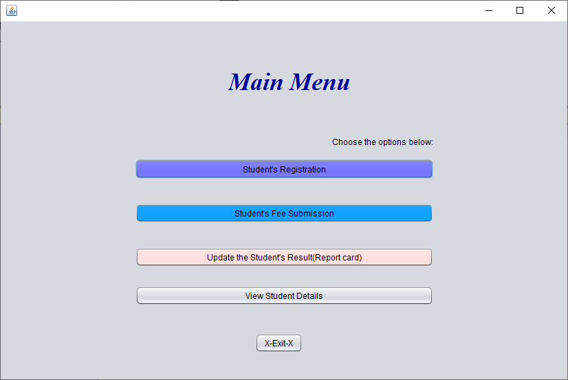
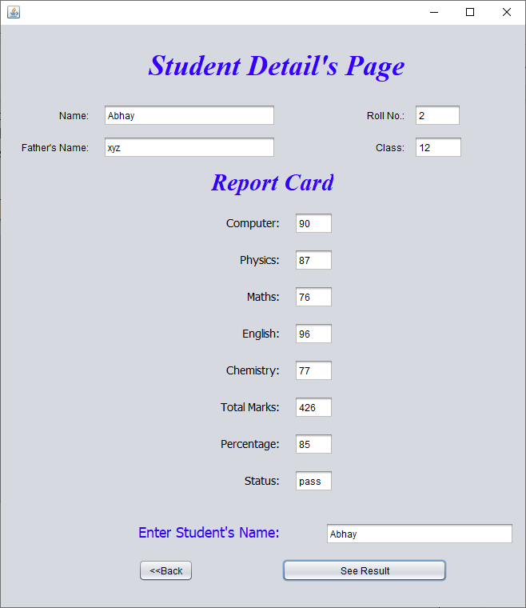
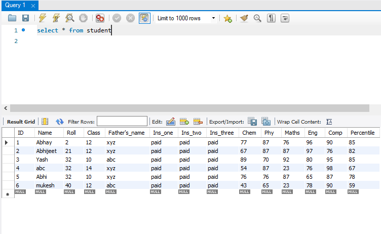

# School Management System

<h1>About our project </h1>
Application of OOP to building a School Management System in Java, that uses core java concepts, Java Swing and MySql .

The functionality of Project: The project is based on 4 modules. 1) Student's Registration 2) Student's Fee Submission 3) Update Student's Result (Report card) and
4)View Student Details Page.

This project will have 6 classes namely LoginPage.java, Main_menu.java, StudentRegistration.java, StudentReportcard.java, Studentfeesubmission.java and StudentDetails.java .
Our project will keep track of the details, fees and grades of students and display the Id, Name, fees of Students and grades of students in the entire school.
LoginPage- Enter username and password to view the main menu page.
Main_menu- We have options to register students, update their fees or report card and view their details.
Student’s Registration- Enter Students name, class, roll number and father’s name which gets stored in database.
Student’s fee submission- Check the checkbox if student has paid his 1st, 2nd or 3rd installment fees which gets updated in database.
Update Student’s Report-  Enter Marks of student in various subjects which gets stored in database.
View Student Details- Enter Student’s Name to view the details and report card of that student if his fees is cleared.

<h2>Tech Used : </h2>
JAVA ,Net beans IDE, Java Swing for GUI and MySQL for database.
